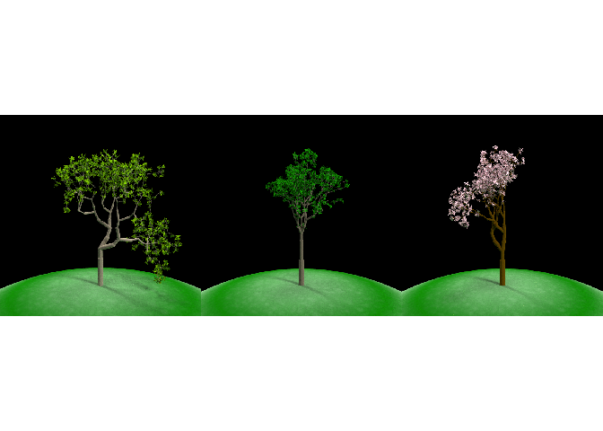
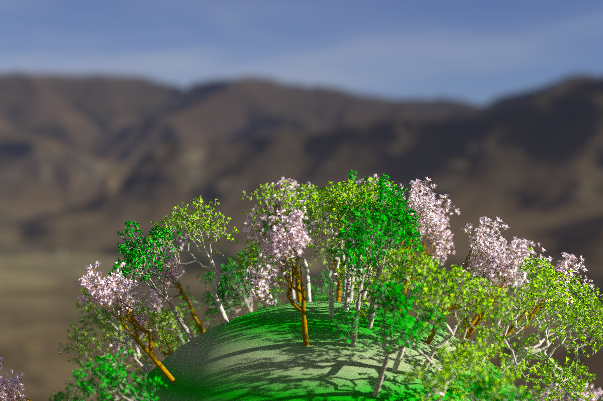
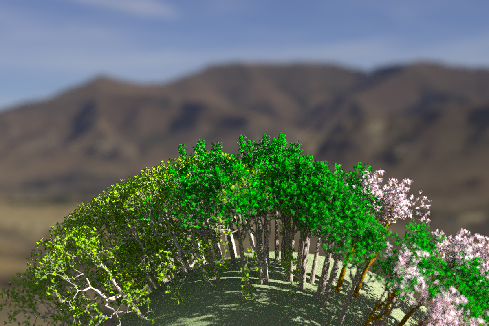

Forest 3D scene
================
Eleanor Jackson
22 May, 2021

``` r
library("rayrender")
library("raybonsai")
library("tidyverse")
```

    ## ── Attaching packages ─────────────────────────────────────── tidyverse 1.3.1 ──

    ## ✓ ggplot2 3.3.3     ✓ purrr   0.3.4
    ## ✓ tibble  3.1.2     ✓ dplyr   1.0.6
    ## ✓ tidyr   1.1.3     ✓ stringr 1.4.0
    ## ✓ readr   1.4.0     ✓ forcats 0.5.1

    ## ── Conflicts ────────────────────────────────────────── tidyverse_conflicts() ──
    ## x ggplot2::arrow() masks rayrender::arrow()
    ## x dplyr::filter()  masks stats::filter()
    ## x dplyr::lag()     masks stats::lag()

``` r
library("mvtnorm")
```

## Define three tree species

``` r
# define species
sp1 <- generate_tree(branch_depth = 8, branch_color = "tan", 
                     leaf_color = "chartreuse4",
                       leaf_depth_start = 5)
sp2 <- generate_tree(branch_angle_vert = c(-20, 0, 20), 
                     branch_depth = 8, branch_color = "burlywood4",
                     leaf_color = "darkgreen",
                       leaf_depth_start = 3)
sp3 <- generate_tree(branch_angle_vert = seq(-30, 30, by = 5),
              branch_depth = 8, leaf_color = "pink", leaf_depth_start = 5)

par(mfrow=c(1,3))
render_tree(sp1)
render_tree(sp2)
render_tree(sp3)
```



## Create a forest of randomly placed individuals

``` r
# create dataset of trees, 50 individuals of each species
# just copy for now, could try generating new random trees with seed in future
trees_df <- tibble(sp = c("sp1", "sp2", "sp3"),
                   tree = list(sp1, sp2, sp3)) %>%
  slice(rep(1:n(), each = 30)) %>%
  mutate(id = row_number())

trees <- trees_df[["tree"]]

# init forest with one tree
one_tree <- trees[[1]]
remaining_trees <- trees[-1]

random_forest <- group_objects(
  one_tree,
  pivot_point = c(0, -10, 0), group_angle = c(0, 0, 10)
)

# build forest by adding trees at random locations
build_random_forest <- function(tree, angle_z) {
  random_forest <<- random_forest %>%
    add_object(
      group_objects(tree, pivot_point = c(0, -10, 0), 
                    group_angle = c(runif(1, -90, 90), 
                                    runif(1, -90, 90), angle_z))
    )
}

walk2(remaining_trees, runif(length(remaining_trees), -90, 90), 
      build_random_forest)

# render forest
# hdr file can be downloaded here: https://hdrihaven.com/hdri/?c=nature&h=kiara_3_morning
random_forest %>%
  render_tree(
    lights = FALSE, environment_light = here::here("kiara_3_morning_2k.hdr"),
    samples = 40,
    fov = 20, lookat = c(2, 4, 2), lookfrom = c(40, 4, 10),
    aperture = 0.5,
    width = 1200, height = 800,
    ground_color1 = "darkgreen", ground_color2 = "darkolivegreen",
    filename = here::here("figures", "random-forest.png")
  )
```



## Create a forest of clustered individuals

``` r
# create dataset of clustered co-ordinates
generate_gaussian_data <- function(n, center, sigma, label) {
  rmvnorm(n, mean = center, sigma = sigma) %>%
  as.data.frame() %>%
  rename(angle_x = V1, angle_y = V2) %>%
  mutate(sp = label)
}

clustered_angles <- {
  # cluster 1
  n <- 30
  center <- c(-50,-50)
  sigma <- matrix(c(500, 0, 0, 500), nrow = 2)
  sp1d <- generate_gaussian_data(n, center, sigma, "sp1")
  # cluster 2
  n <- 30
  center <- c(0, -50)
  sigma <- matrix(c(500, 0, 0, 500), nrow = 2)
  sp2d <- generate_gaussian_data(n, center, sigma, "sp2")
  # cluster 3
  n <- 30
  center <- c(50, -50)
  sigma <- matrix(c(500, 0, 0, 500), nrow = 2)
  sp3d <- generate_gaussian_data(n, center, sigma, "sp3")
  # all data
  bind_rows(sp1d, sp2d, sp3d)
}

# check clustering
bind_cols(trees_df, select(clustered_angles, -sp))%>%
  ggplot(aes(x = angle_x, y = angle_y, colour = sp)) +
  geom_point() +
  ylim(-90, 90) +
  xlim(-90,90)

bind_cols(trees_df, select(clustered_angles, -sp)) -> clust_dat

# init forest with one tree
slice_head(clust_dat) %>%
  select(-sp, -id) %>%
  mutate(angle_z = 10) -> one_tree_cl_df

trees_cl <- clust_dat[["tree"]]

one_tree_cl <- trees_cl[[1]]

forest_cl <- group_objects(
  one_tree_cl,
  pivot_point = c(0, -10, 0), 
  group_angle = c(clust_dat[[1,4]], clust_dat[[1,5]], 10)
)

# add other trees to forest
clust_dat[-1,] %>%
  select(-sp, -id) %>% 
  mutate(angle_z = runif(1, -90, 90)) -> remaining_trees_cl

build_cluster_forest <- function(tree, angle_x, angle_y, angle_z) {
  forest_cl <<- forest_cl %>%
    add_object(
      group_objects(tree, pivot_point = c(0, -10, 0), 
                    group_angle = c(angle_x, angle_y, angle_z))
    )
}

pwalk(remaining_trees_cl, build_cluster_forest)

# render forest
forest_cl %>%
  render_tree(
    lights = FALSE, environment_light = here::here("kiara_3_morning_2k.hdr"),
    samples = 100,
    fov = 20, lookat = c(2, 4, 2), lookfrom = c(40, 4, 10),
    aperture = 0.5,
    width = 1200, height = 800,
    ground_color1 = "darkolivegreen", ground_color2 = "darkolivegreen",
    filename = here::here("figures", "cluster-forest-100.png")
  )
```


